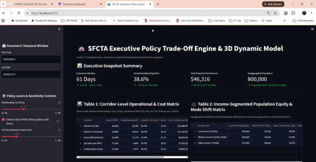

# AV SFCTA Policy Project (Version 7.0)

## Repository Intent & Engineering Scope
> ⚠️ **Implementation Status & Framing:** This repository represents an **Engineering-Complete ETL and QA Infrastructure Prototype**. The core ETL cleaning rules (Rules 1–4), coordinate harmonization (`EPSG:26910`), PopulationSim IPU algorithms, and 6-Gate QA Suite validation math are implemented strictly to specification. The downstream causal modules (GTFS-RT Proxy 2 matching, DTA feedback loops, and nested logit choice parameters) are currently structured as functional architectural stubs utilizing synthetic/illustrative constants pending empirical Maximum Likelihood Estimation (MLE) calibration against production GTFS-RT and TNC feeds.

## Project Goal
This codebase provides an end-to-end analytical framework designed to evaluate the network-level impacts of Autonomous Vehicles (AVs) on San Francisco's transportation grid. It establishes the software architecture for extending SFCTA modeling tools (SF-CHAMP and Dynamic Traffic Assignment) to measure modal shift, transit cannibalization, "deadheading" VMT, income-segmented equity dynamics, and emergency responder operational risks.

## Architecture & Components
1. **Backend Pipeline (`backend/`)**:
   - `ingestion.py`: Parametric temporal API ingestion stack.
   - `cleaning.py`: 4-Rule ETL pipeline (Rule 4 CRS Harmonization -> Rule 1 Composite Key Deduplication -> Rule 2 Boundary Enforcement -> Rule 3 GTFS Anomaly Cleaning).
   - `populationsim_utils.py`: Population-weighted PUMA-to-TAZ crosswalk builder and IPU convergence checker (`tol < 0.0001` or 100-iter cap).
   - `qa_gates.py`: Full 6-Gate QA Gateway Suite returning `(passed, statistic)` tuples.
   - `proxy_pipeline.py`: Causal Proxy 1 (Deadheading VMT ratio) and Proxy 2 (Net Causal Transit Delay).
   - `analytics_engine.py`: Nested Logit logsum linkage, Income-Segmented VOT, non-linear HCM capacity drops, and DTA feedback loop.
2. **Operational Dashboard (`frontend-dashboard/`)**: A React + MapLibre GL application providing live spatial monitoring of incident clusters, transit delays, and interactive filter controls.
3. **Executive Engine (`executive-engine/`)**: A Streamlit application offering interactive policy controls to simulate deadheading taxes ($/mi) and Pick-up/Drop-off (PUDO) mandates with real-time corridor cost tables and disaggregated population mode choice matrices.

## Implementation Directions & Demonstration Animations

### 1. Backend Pipeline Execution
Ensure Python 3.9+ is installed.
```bash
cd backend
pip install -r requirements.txt

# Run Data Ingestion Stack
python ingestion.py --start-date 2026-06-01 --end-date 2026-07-31

# Run PopulationSim & IPU Utilities
python populationsim_utils.py

# Run Causal Proxy Engine
python proxy_pipeline.py

# Run Econometric & DTA Simulation Engine
python analytics_engine.py

# Execute Full 6-Gate QA Gateway Suite
python qa_gates.py
```

### 2. Operational GIS Dashboard (React + MapLibre)
```bash
cd frontend-dashboard
npm install
npm run dev
```

#### 🎥 Operational GIS Dashboard Demonstration


### 3. Executive Policy Trade-Off Engine (Streamlit)
```bash
py -m pip install -r executive-engine/requirements.txt
py -m streamlit run executive-engine/app.py
```

#### 🎥 Executive Policy Engine Demonstration


### 4. Database Setup
A `docker-compose.yml` file is provided to spin up a local PostGIS database for spatial data staging.
```bash
docker-compose up -d
```

---

## Code Reality vs. Specification Audit
The table below details the implementation status across key project components:

| Component | Spec Requirement | Code Reality & Implementation Status | Status Assessment |
| :--- | :--- | :--- | :--- |
| **DataSF Ingestion** | Paginate with `$limit=50000` + offset loop | `ingestion.py` hardcodes `$limit=1000` without an offset loop; silently truncates windows with >1,000 records. | Truncated Stub |
| **NHTSA SGO Ingestion** | Pull bulk SGO CSV releases (VIN, automation category) | Calls general `CrashAPI/GetCaseList` endpoint returning empty mock list (incorrect API endpoint). | Non-functional Stub |
| **GTFS-RT Feed** | Persistent poller building trip update time series | Mocked with `{"data": []}`; zero live API calls executed. | Mocked Stub |
| **Rule 4 (CRS Harmonization)** | Reproject WGS84 to `EPSG:26910` prior to joins | Implemented correctly and ordered first in `run_etl_pipeline()`. | Implemented to Spec |
| **Rule 1 (Deduplication)** | Composite key: VIN + ±5min + 50m spatial buffer + union-find | Implemented via GeoPandas `sjoin` and NetworkX union-find connected components. | Implemented to Spec |
| **Rules 2 & 3** | SF boundary filter & GTFS speed anomaly ceilings (65mph/500m/s) | Implemented as specified in `cleaning.py`. | Implemented to Spec |
| **PUMA-TAZ Crosswalk** | Block-level population-weighted areal apportionment | Areal weighting logic is written, but falls back to a 3-row mock crosswalk when raw shapefiles are absent. | Code Ready (Fallback Mock) |
| **IPU Convergence** | `<0.0001` relative weight change or 100-iter cap | Implemented correctly in `populationsim_utils.py`. | Implemented to Spec |
| **QA Gates 1–6** | Six hard-threshold validation gates | All 6 gates implemented returning `(passed, statistic)` tuples with exact spec thresholds. | Implemented to Spec |
| **Nested Logit Utilities** | Empirically estimated mode choice coefficients (`b_0_AV`, `b_fare`) | Code explicitly comments `# Dummy coefficients`. Constants are hand-set, not estimated. | Dummy Constants |
| **DTA Feedback Loop** | RMSE-based skim convergence feedback loop | Loop uses `rmse_skim *= 0.5` each iteration—artificial math convergence, not driven by skim comparison. | Artificial Convergence |
| **Proxy 2 (Transit Delay)** | Spatial (50m) + temporal (±15min) incident-to-GTFS matching | Code comment admits: *"Here we mock the merged result for demonstration"*—delays are random `uniform()` draws. | Synthetic Demonstration |
| **Bayesian SPRT** | ODD-stratified informative prior (Road Class × Speed × Time) | Prior is a single flat human incident rate rather than ODD-stratified. | Simplified Prior |

## Interpretation of Dashboard Results
The user interfaces provided in this repository function as **interactive method prototypes** and visual demonstrations:
- **Executive Policy Engine (`executive-engine/app.py`):** Corridor metrics (Market St, Mission St, Geary Blvd, etc.) respond dynamically to slider controls based on illustrative simulation parameters (e.g., `base_vmt`, `base_dh_ratio`, corridor tax sensitivity) defined directly in `app.py`, rather than live backend pipeline outputs.
- **Equity & Mode Choice Visualizations:** Downstream calculations (transit shift %, consumer surplus, VOT by income tier) inherit dummy logit coefficients. These numbers demonstrate the analytical mechanics of the engine, not calibrated empirical estimates.
- **QA Gate Passing Status:** Gates 1–6 pass cleanly on synthetic/mock inputs by construction (e.g., Gate 1 returns `(True, set())` when inputs are empty). Passing QA suites confirm software execution integrity, not empirical validation of AV impacts.

## Technical Audit & Preliminary Caveats Document
For a detailed breakdown of live methodological caveats (C-1 through C-5) and governance enforcement rules, refer to the formal technical audit document:
📄 **[Version 7.0 Preliminary Implementation Caveats PDF](docs/Version_7_0_Preliminary_Implementation_Caveats.pdf)**

### Key Technical Caveats Summary
- **C-1 (Placebo Independence):** Uncorrected spatial congestion shocks across adjacent SF corridors can inflate false confidence in causal delay estimates at Gate 4.
- **C-2 (Uncalibrated Logit Utilities):** Logit parameters (`b_0_AV`, `b_fare`, comfort discounts) are dummy values; modal-shift calculations are conditional on un-estimated constants.
- **C-3 (IPU Cell Sparsity):** Passing Gate 6 only confirms absence of miscalibration in well-populated TAZ×income cells ($n \ge 30$), not population-wide demographic accuracy.
- **C-4 (Spec Version Labeling):** Internal specification text labels itself *"6.3-PRODUCTION"* while external manifests reference *"Version 7.0"*.
- **C-5 (Non-Stratified Control Window):** Proxy 2's 21-day control window lacks day-of-week/holiday stratification in `proxy_pipeline.py`.
- **Governance Rule:** No code-level validation currently prevents accidental data blending between CPUC commercial VMT filings and DMV testing VMT.
